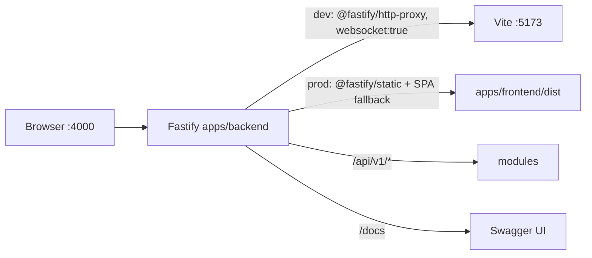

# Repository Guidelines

## Project Overview

Sheetor is an interactive guitar TAB + sheet-music editor with in-browser playback. npm-workspaces monorepo:

- `apps/frontend` — React 19 SPA (Vite), the entire product surface.
- `apps/backend` — Fastify 5 API + Swagger, and the single user-facing HTTP entry point (it fronts the SPA).

The editor is currently **offline-first**: no frontend code calls the backend. Songs live in `localStorage`. The backend exists as an API scaffold (`GET /api/v1/health`) plus SPA host/dev-proxy.

## Architecture & Data Flow

### Serving topology (one port, two processes)

`npm run dev` starts both apps with `concurrently`. Everything is used through **`http://localhost:4000`**; Vite's `:5173` is an upstream detail.



`apps/backend/src/plugins/frontend.ts` branches on `env.nodeEnv === 'development'` (strict equality — any other value selects the static/prod path). Vite is **not** in-process middleware.

### Backend boot chain

`src/server.ts` (env, `app.listen`, `process.exit(1)`) → `src/app.ts` `buildApp()`. Registration order in `buildApp()` is **load-bearing**:

1. `registerSwagger` — must precede routes so their schemas are collected.
2. `registerModules` — the **only** place `/api/v1` is applied.
3. `registerFrontend` — claims `prefix: '/'` and installs `setNotFoundHandler`; anything registered after it can be shadowed.

`src/plugins/*` are **not** Fastify plugins — they are plain `(app: FastifyInstance, …) => Promise<void>` wiring functions called with the root instance. Only `src/modules/<feature>/routes.ts` files are real `FastifyPluginAsync`. `fastify-plugin` is not a dependency.

### Frontend data flow

Mount chain: `index.html#root` → `src/main.tsx` (`createRoot` + `StrictMode`) → `src/App.tsx` → `src/app/layout/AppLayout.tsx` → `src/app/ErrorBoundary.tsx` → `src/features/editor/pages/EditorPage.tsx` → `TabSheetEditor.tsx`. No router, no context, no providers.

- **State**: ~20 `useState` hooks inside `TabSheetEditor.tsx` — the whole app, minus playback. No `useReducer`, no store library. `usePlayback` is the only custom hook.
- **Mutation**: every edit is a named closure using `setSong(prev => …)` with immutable `map`/spread rebuilds. `updateActiveBeatNotes` is the shared primitive behind fret entry, technique toggles, and note removal.
- **Persistence**: `useEffect(() => saveSong(song), [song])` → `localStorage` key `'sheetor-song'` (`persistence.ts`). Loads are validated by `parseSong` (`songSchema.ts`); a rejected blob is moved to `'sheetor-song.invalid'` and the fallback song is used. Only `song` is persisted — `tuning`, `volume`, `synthType`, and UI flags reset on reload (initial `tuning` width is derived from the loaded song via `requiredStringCount`).
- **Playback**: owned entirely by `usePlayback.ts` (raw Web Audio API). `requestAnimationFrame` lookahead scheduler (100 ms) advancing `nextBeatTimeRef`; cursor position advances through `nextBeatPosition`, which always terminates. Every setting (`song`, `tuning`, `volume`, `synthType`, `loop`, `speed`) is read through `settingsRef`, refreshed by a dependency-less effect after each render, so mid-playback changes take effect on the next scheduled beat. `synthType === 'guitar'` uses the Karplus-Strong buffer from `audioEngine.ts`, otherwise an `OscillatorNode` + ADSR gain.
- **Rendering**: notation is one inline `<svg className="music-svg">` with a computed `viewBox` and hand-written `<path>` glyphs (clef, flags, beams); the virtual fretboard is DOM `<div>`s with computed inline styles. No canvas, no VexFlow/alphaTab.
- **Geometry**: `layout.ts` is pure, React-free, and owns all constants (`MAX_ROW_WIDTH 980`, `TAB_STAFF_TOP 90`, `FRET_COUNT 15`, …) plus `computeMeasureLayouts` two-pass line breaking/stretching.

## Key Directories

| Path | Purpose |
|---|---|
| `apps/backend/src/modules/<feature>/routes.ts` | Feature routes (`FastifyPluginAsync`), prefix-relative paths |
| `apps/backend/src/plugins/` | Infra wiring functions (swagger, frontend serving) |
| `apps/backend/src/config/` | `env.ts` — the whole runtime config surface |
| `apps/frontend/src/app/layout/` | `AppLayout`/`AppHeader`/`AppFooter`, presentational only |
| `apps/frontend/src/features/editor/components/` | The editor **and** its pure modules (`types.ts`, `layout.ts`, `songUtils.ts`, `songSchema.ts`, `persistence.ts`, `audioEngine.ts`, `usePlayback.ts`) plus their `*.test.ts` files |
| `apps/frontend/src/features/editor/pages/` | `EditorPage.tsx` (5 lines of indirection) |

Note the shape gotcha: the non-component modules sit under `components/`, not at `features/editor/`. There is no `shared/`, `lib/`, or `utils/` directory.

## Development Commands

```bash
npm install                 # root only — workspaces are hoisted
npm run dev                 # backend + frontend; use http://localhost:4000
npm run dev:backend         # tsx watch src/server.ts
npm run dev:frontend        # vite (:5173, strictPort)
npm run build               # both workspaces
npm run lint                # frontend: eslint . (backend has no ESLint config)
npm run typecheck           # frontend: tsc -b | backend: tsc --noEmit
npm test                    # frontend: vitest run (pure modules)
npm run start:backend       # node dist/server.js  (needs NODE_ENV=production)
```

Verification gates, exactly:

```bash
npm test                                        # vitest run — pure modules
npm run typecheck                               # tsc -b (frontend) + tsc --noEmit (backend)
npm run lint                                    # ESLint (frontend only)
NODE_ENV=production npm run build && NODE_ENV=production npm run start:backend
curl -s localhost:4000/api/v1/health            # smoke
```

`npm run lint` currently emits one pre-existing `react-hooks/exhaustive-deps` warning (the auto-scroll effect) and exits 0.

## Code Conventions & Common Patterns

### Both apps

- ESM everywhere (`"type": "module"`); named exports are the norm (`App` and `TabSheetEditor` are the only default exports).
- `import type { … }` for every type-only import (`verbatimModuleSyntax` is on for the frontend).
- Arrow-function consts with explicit return annotations for module-level functions.
- No path aliases in any tsconfig — **relative imports only**.
- TypeScript is pinned `~5.9.3` per workspace.

### Backend

- **Relative imports MUST carry `.js`** (`NodeNext`): `import { env } from './config/env.js'`.
- Adding a feature module:

  ```ts
  // src/modules/songs/routes.ts
  import type { FastifyPluginAsync } from 'fastify';

  export const songRoutes: FastifyPluginAsync = async (app) => {
    app.get('/songs', {
      schema: { tags: ['songs'], summary: 'List songs',
        response: { 200: { type: 'array', items: { type: 'object' } } } },
    }, async () => listSongs());
  };
  ```

  Then register in `src/modules/index.ts` with `{ prefix: '/api/v1' }`, and add any new Swagger tag to the `tags` array in `src/plugins/swagger.ts`. Never hardcode `/api/v1` inside a route file.
- Handlers **return** payloads; `reply` is untouched in module routes. Schemas are inline JSON Schema (no TypeBox/zod, no type provider — so a handler's return type is *not* checked against its schema; extra fields are silently stripped at serialization).
- Config: extend `AppEnv` + `env` in `config/env.ts` rather than reading `process.env` inline. `env` is snapshotted at module load. (`LOG_LEVEL`, read directly in `app.ts`, is the one existing violation.)
- Error handling is Fastify default — no `setErrorHandler`, no custom error classes, no CORS plugin, no graceful shutdown. The only hand-written error body is the prod SPA 404 `{ message: 'Not Found' }` for `/api*` and `/docs*`.

### Frontend

- Function components only; arrow + named export (`export const AppHeader = () => …`). `React.FC` appears once; there is no established `type Props = …` convention (`AppLayout({ children }: PropsWithChildren)` is the only props-taking component).
- Naming: components PascalCase (`TabSheetEditor.tsx`, matching `TabSheetEditor.css`), non-component modules camelCase (`songUtils.ts`), directories lowercase.
- CSS: plain global stylesheets imported for side effect; kebab-case classes namespaced `sheetor-*`; inline `style={{}}` only for computed geometry. No CSS modules, no Tailwind.
- **Design tokens live in `src/index.css` (`:root`) and are the only place a colour, radius, spacing step, control height or shadow is defined.** Reference them (`var(--surface-2)`, `var(--sp-3)`, `var(--ctl-h)`) — a new hex or a magic `12px` in a component stylesheet is a defect. The palette is a warm near-black surface ramp with a single amber accent plus `--danger`/`--warn`/`--ok`.
- One control rhythm: every button, field and menu trigger is `var(--ctl-h)` tall with `var(--r-md)` corners. `.btn` and `.bottom-menu-trigger` are deliberately identical so the command bar has one silhouette; `.btn-primary` (amber fill) marks the single main action, `.btn-active` (amber tint) marks a toggle that is on.
- Exception: SVG **presentation attributes cannot resolve `var()`**, so glyph `fill`/`stroke` in `TabSheetEditor.tsx` are literal hexes mirroring the tokens (`#f2ece4` = `--text`, `#6f6862` = `--text-faint`, `#d98a3f` = `--accent`). Change the token and the literals together. `--paper` must equal `.tab-fret-bg`'s fill or the fret-number knockouts show as boxes.
- Icons are hand-inlined 24×24 `<svg>` with `stroke="currentColor"` — no icon package.
- Pure logic belongs **outside** the component: geometry/constants → `layout.ts`, music theory/model → `songUtils.ts`. `audioEngine.ts` receives an `AudioContext`, never owns one.
- Strict typing with **no `any` anywhere** — the former `(window as any).webkitAudioContext` and `catch (err: any)` are gone. Unvalidated input is `unknown` and passes through `parseSong`; the prefixed `AudioContext` is reached by `in` narrowing plus one named cast in `usePlayback.ts`. Do not reintroduce `any`.

### Domain invariants (`features/editor/components/types.ts`)

- `TabNote.stringIndex` is **0 = highest string**, matching `tuning[]` high→low. Every Y coordinate depends on this.
- `duration` is a string union `'1'|'2'|'4'|'8'|'16'|'32'` — convert with `getDurationVal` (quarter = 1.0, dot = ×1.5), never arithmetic on the literal. The union is re-spelled inline in ~12 signatures instead of a named alias; changing durations touches all of them.
- `TabMeasure.bpm`/`timeSignature` are optional overrides resolved by backward scan (`getEffectiveBpm`, `getEffectiveTimeSignature`) falling back to the `TabSong` values.
- IDs are the inline expression `Math.random().toString(36).substring(2, 9)`, duplicated in 15+ places across `TabSheetEditor.tsx` and `songUtils.ts`; no helper exists.

## Important Files

| File | Role |
|---|---|
| `apps/backend/src/server.ts` / `app.ts` | Process entry / `buildApp()` + registration order |
| `apps/backend/src/config/env.ts` | `AppEnv`, `env`, `toPort` |
| `apps/backend/src/plugins/frontend.ts` | Dev proxy vs prod static + SPA fallback |
| `apps/backend/src/modules/index.ts` | Sole `/api/v1` prefix site |
| `apps/backend/src/modules/health/routes.ts` | Canonical route template |
| `apps/frontend/src/features/editor/components/TabSheetEditor.tsx` | The application (state, keyboard, SVG render) |
| `apps/frontend/src/features/editor/components/usePlayback.ts` | All playback: scheduler, voices, transport state |
| `apps/frontend/src/features/editor/components/songSchema.ts` | `parseSong` — the only validation boundary for stored/imported songs |
| `apps/frontend/src/features/editor/components/layout.ts` | Pure layout geometry |
| `apps/frontend/src/features/editor/components/songUtils.ts` | Music theory, beaming, MIDI ↔ note names, `createId`/`createEmptySong`, beat-position walking |
| `apps/frontend/vite.config.ts` | `port: 5173, strictPort: true` — must match `FRONTEND_DEV_URL` |
| `apps/frontend/vitest.config.ts` | `include: ['src/**/*.test.ts']`, `environment: 'node'` |
| `apps/frontend/eslint.config.js` | ESLint 9 flat config (frontend only) |

### Environment variables (all backend, all optional)

| Var | Default | Notes |
|---|---|---|
| `PORT` | `4000` | Coerced by `toPort`; non-finite or ≤0 falls back |
| `HOST` | `0.0.0.0` | |
| `NODE_ENV` | `development` | `=== 'development'` selects the Vite proxy; anything else serves `dist` |
| `FRONTEND_DEV_URL` | `http://localhost:5173` | Proxy upstream |
| `LOG_LEVEL` | `info` | Read directly in `app.ts`, not in `AppEnv` |

No `.env` file exists, and `.gitignore` does **not** ignore `.env*` — do not commit one without adding the pattern.

## Runtime/Tooling Preferences

- **npm is the package manager** (single root `package-lock.json`, `lockfileVersion: 3`). No Bun, pnpm, or yarn anywhere; no `packageManager` or `engines` field. Install from the repo root, never inside a workspace.
- Node ≥ 20 in practice (`@types/node` ^24, NodeNext ESM); unpinned.
- `vite` is aliased to **`npm:rolldown-vite@7.2.5`**, not upstream Vite. Plugin/version advice must account for the Rolldown build.
- Backend dev runs TypeScript directly via `tsx watch` — no build step in dev. Prod is `tsc -p tsconfig.build.json` → `node dist/server.js`.
- Frontend tsconfig is solution-style (`tsconfig.json` → `tsconfig.app.json` for `src`, `tsconfig.node.json` for `vite.config.ts`), driven by `tsc -b`. Frontend strictness exceeds the backend's: `strict`, `noUnusedLocals`, `noUnusedParameters`, `erasableSyntaxOnly`, `noFallthroughCasesInSwitch`, `verbatimModuleSyntax`.
- **No formatter** (no Prettier, no `.editorconfig`), **no CI**, **no git hooks**. Match surrounding style by hand.
- ESLint covers the frontend only; the backend's gate is `npm run typecheck` (`tsc --noEmit`).

## Git & Commits

- **Commit incrementally.** Land one commit per coherent step, as soon as that step's verification passes — do not batch an entire task into a single commit at the end. A step that touches code plus its test/doc updates is one commit.
- **Never `git push`.** Pushing happens only on an explicit request from the user. Same for anything that rewrites shared history (`rebase`, `push --force`, `commit --amend` on an already-pushed commit).
- **Message style is plain and free-form**, matching the existing history (`initial commit`, `made monorepo`) — no Conventional Commits prefixes. Short imperative subject ≤72 chars; add a body only when the *why* is not obvious from the diff.
- **Stage deliberately** (`git add <path>`), never `git add -A`. The working tree may hold unrelated in-progress edits; keep them out of your commit and say so if they are inseparable.
- Do not create branches or tags unless asked; commit onto the current branch.

## Testing & QA

Vitest 3 is installed in the **frontend workspace only** (`vitest run`, config at `apps/frontend/vitest.config.ts`). Tests are colocated as `src/**/*.test.ts` and cover the pure modules — `songUtils`, `songSchema`, `persistence`, `audioEngine`. There is no jsdom, no component/DOM testing library, and no coverage gate: anything needing a browser is verified by hand.

Conventions for new tests:

- Explicit imports from `'vitest'` (`globals` is off).
- `localStorage` is stubbed per test with `vi.stubGlobal` over a `Map`-backed object; never assume a DOM.
- Web Audio is stubbed with a minimal object cast `as unknown as AudioContext`.
- Assert observable behavior (returned values, storage contents, error strings), not internals.

Verify a change by:

1. `npm test` — pure-module behavior.
2. `npm run typecheck` — both workspaces (`tsc -b` for the frontend; stale `.tsbuildinfo` can mask errors and no `clean` script exists).
3. `npm run lint` — frontend ESLint.
4. Manual runtime check: `npm run dev`, then exercise the editor at `http://localhost:4000/`, Swagger at `/docs`. Playback, focus, and SVG-render changes have no automated coverage and **must** be driven in a browser.

## Gotchas

- `npm run start:backend` without `NODE_ENV=production` proxies to a Vite server that isn't running. Prod also requires `build:frontend` first — `frontendDistDir` is `path.resolve(__dirname, '../../../frontend/dist')` relative to the **compiled** file, so moving `outDir` or that file silently breaks static serving at runtime.
- `TabSheetEditor.tsx` is monolithic; prefer extracting pure helpers into `layout.ts`/`songUtils.ts` over growing it.
- The command bar is the **only** control surface; earlier duplicates (`.sheetor-toolbar`, `.sheetor-controls`, `.sheetor-footer`) were deleted, so a command is added in exactly one place. Duration-glyph SVGs are still written out per duration in the note-options panel.
- Playback settings are live via `settingsRef` in `usePlayback`; if you add a setting, thread it through `PlaybackSettings` or it will silently stay frozen at `start()` time.
- `computeMeasureLayouts` mutates the `MLayout` objects it returns during the stretch pass — treat the array as freshly owned, never cache it.
- No memoization anywhere (`useMemo`/`useCallback`/`React.memo` are absent): full layout + beam computation reruns every render.
- `persistence.ts` quarantines an invalid `sheetor-song` to `sheetor-song.invalid` and logs a `console.warn`; it has no schema *version*, so shape migrations must be expressed as repair rules inside `parseSong`.
- `tuning` is UI state and is not persisted. It is widened on load/import (`requiredStringCount`) and shrinking it prunes stranded notes (`pruneNotesToStringCount`); any new tuning-mutation site must do both or notes get an `undefined` pitch (`NaN`).
- `sampleSongs` in `songUtils.ts` is exported but never imported (dead data). `src/assets/react.svg` is an unreferenced template leftover, and a stale pre-monorepo `dist/` sits at the repo root — not produced by any current script.
- Time-signature validation (`checkMeasureBeats`) is advisory only: it tints the measure, it does not prevent over/under-filled bars.
- Commit history is short and free-form (`initial commit`, `made monorepo`) — not conventional commits.
