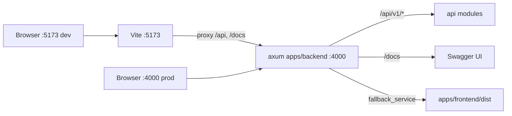

# Repository Guidelines

## Project Overview

Sheetor is an interactive guitar TAB + sheet-music editor with in-browser playback. npm-workspaces monorepo:

- `apps/frontend` — React 19 SPA (Vite), the entire product surface.
- `apps/backend` — Rust axum API + Swagger (utoipa), and in production the single user-facing HTTP entry point (it serves the built SPA).

The editor is **offline-first but sign-in gated**: songs live in `localStorage` and never leave the browser, yet nothing renders until the visitor has a server session. The backend is a signup/session API (`/api/v1/system/health`, `/api/v1/users/{create,login,logout,me}`) plus prod SPA host.

## Architecture & Data Flow

### Serving topology

`npm run dev` starts both processes with `concurrently`. In dev the browser talks to **Vite on `http://localhost:5173`**, which proxies `/api` and `/docs` to axum on `:4000`. In production there is one port: axum serves the built SPA itself on `:4000`.



Static serving is **presence-based, not env-based**: `frontend::serve` mounts `ServeDir` plus an `index.html` SPA fallback only when `frontend_dist_dir` is a directory; otherwise it logs `frontend build missing` and the router stays api-only. There is no `NODE_ENV` switch and no reverse proxy inside Rust.

### Backend boot chain

The crate is a **library plus a thin binary**. `src/lib.rs` declares every module; `src/main.rs` only reads config, opens the pool and serves. That split exists so `apps/backend/tests/` can `use sheetor_backend::…` — an integration test cannot import a bin-only crate — and so `pub` items are public API rather than dead code under `clippy -D warnings`.

`src/main.rs` (config, tracing, `database::init_pool`, `TcpListener`, `axum::serve`) → `src/app.rs` `build(&Config, PgPool).await`, async because the session store creates its own table on the way up. The pool is opened **before** the listener: a process that cannot reach its database should fail at boot, not on the first request. The order inside `build` is **load-bearing**:

1. `PostgresStore::new(db.clone())` then `.migrate()` — creates `tower_sessions.session`.
2. `SessionManagerLayer` (`HttpOnly`, `SameSite=Strict`, `Secure` from `config.cookie_secure`) wrapped by `AuthManagerLayerBuilder` around `auth_service::Backend`.
3. `api::router(AppState::new(db))` → the `/api/v1`-nested router plus the collected `OpenApi`.
4. `/api` and `/api/{*path}` catch-alls → JSON `{"message":"Not Found"}`, so an unknown API path never falls through to the SPA.
5. `SwaggerUi::new("/docs").url("/docs/openapi.json", openapi)`.
6. `.layer(auth_layer)` — above `frontend::serve` on purpose, so the SPA's static assets never touch the session store.
7. `frontend::serve` — installs the SPA `fallback_service`; it must stay last because it claims everything unmatched.
8. `TraceLayer` wraps the finished router.

There is no plugin system: `src/api/<feature>/mod.rs` builds that feature's `OpenApiRouter`, and each endpoint gets its own file beside it (`users/create.rs`, `users/login.rs`) holding the handler with its `#[utoipa::path]`. `src/api/mod.rs` is the only place `/api/v1` and the tag list exist. `route_layer` applies to the routes registered **before** it, so a guarded route goes above `login_required!` and the public ones below — invert it and you need a session to obtain a session.

### Frontend data flow

Mount chain: `index.html#root` → `src/main.tsx` (`createRoot` + `StrictMode`) → `src/App.tsx` (`BrowserRouter`) → `src/app/AuthGate.tsx` → `src/app/layout/AppLayout.tsx` → `src/app/ErrorBoundary.tsx` → the routed page. Three routes, all client-side: `/` → `features/editor/pages/EditorPage.tsx` → `TabSheetEditor.tsx`, `/library` → `features/library/pages/LibraryPage.tsx`, `/settings` → `features/settings/pages/SettingsPage.tsx`; anything unmatched falls back to the editor. The open library folder is the `?folder=<id>` search param (`useSearchParams`), not component state, so browser back walks out of a folder and a link opens one; an id that names no folder renders the root. `react-router-dom` is the only routing dependency — still no context and no providers. Deep links survive a hard reload because axum's SPA fallback serves `index.html` for unknown paths.

**There is deliberately no `/login` route.** `AuthGate` sits *inside* `BrowserRouter` and *above* `AppLayout`, and while there is no session it renders `features/user/pages/LoginPage.tsx` in place of the entire application — header included. Because the URL is never touched, whatever deep link the visitor arrived on renders the moment they sign in, with no `?next=` to thread through. It renders nothing but a splash until `GET /users/me` answers, so the application is never briefly visible to an anonymous visitor and a returning one never sees the form flash.

- **State**: ~20 `useState` hooks inside `TabSheetEditor.tsx` — the whole app, minus playback. No `useReducer`, no store library. `usePlayback` is the only custom hook.
- **Mutation**: every edit is a named closure using `setSong(prev => …)` with immutable `map`/spread rebuilds. `updateActiveBeatNotes` is the shared primitive behind fret entry, technique toggles, and note removal.
- **Persistence**: three `localStorage` stores (library, settings, user), all validating at the boundary. The two other `features/user/` modules are not persistence: `session.ts` is deliberately in-memory and `authApi.ts` is the network.
  - `features/library/libraryStore.ts` owns key `'sheetor-library'` — `{ entries: LibraryEntry[]; folders: LibraryFolder[]; currentId: string | null }`, entries newest-touched first. Every mutator (`addSong`, `replaceSong`, `duplicateSong`, `deleteSong`, `moveSong`, `setCurrentSong`, `createFolder`, `renameFolder`, `moveFolder`, `deleteFolder`) is pure: it takes a `Library` and returns a new one — the same reference when nothing changed — and the caller decides when to `saveLibrary`. An entry whose song fails validation is **dropped**; an unusable blob is quarantined to `'sheetor-library.invalid'`. On first load with no library it migrates the pre-library key `'sheetor-song'` into a single entry and removes it.
  - **Folders are flat**: `LibraryFolder { id, name, parentId }` plus `entry.folderId`, both `null` at the root. The tree is only ever *derived* — `folderPath`, `childFolders` (name-sorted), `songsIn` (stored order), `countSongsIn` (whole subtree), `folderChoices` (depth-first, `excludeSubtreeId` for the set a folder may not move into) — so a move is a one-field edit and no mutator rewrites a nested structure. `moveFolder` refuses a cycle; `deleteFolder` **never deletes a song**, it reparents the folder's children and songs one level up.
  - `features/settings/settingsStore.ts` owns key `'sheetor-settings'` (`AppSettings`: `masterVolume`, `playbackSpeed`, `loopPlayback`, `showToolPanel`, `readOnly`, `defaultBpm`). Validation is **field by field** — one bad value can never discard the rest.
  - `features/user/userStore.ts` owns key `'sheetor-user'` (`User`: `id`, `name`, `email`, `theme`, `accent`) — the profile as this browser displays it. Field-by-field validation, plus a module-level cache so `getUserSnapshot` can feed `useSyncExternalStore` a stable reference, and a `subscribeUser` listener set so the header chip and the settings page never disagree. Signing in mirrors the account into it (`id`, `name`, `email`); `theme` and `accent` are local-only and are never touched by the server.
  - `features/user/session.ts` is the one store that is **not** persisted, on purpose: it holds `'checking' | 'in' | 'out'` and nothing about it may survive a reload, because a stored "signed in" flag becomes a lie the moment the cookie expires. Same listener-set shape as `userStore`, so `AuthGate` and the settings page read it with `useSyncExternalStore`.
  - `features/user/authApi.ts` is the only module in the SPA that calls the backend. `login`, `register`, `logout` and `fetchSession` each leave both stores correct, so no caller has to remember to flip the session itself. The session is the `HttpOnly` cookie the response sets — no script reads or stores a token. `register` posts `/users/create` and then `/users/login`, because creating an account issues no cookie.
  - The editor takes one snapshot of the library and the settings at mount (the `session` state), autosaves the open song with `useEffect(() => saveLibrary(replaceSong(…)), [song, songId])`, and writes the five shared playback/panel values back through `updateSettings` when they change, so the settings page and the transport never disagree. `tuning` is still per-track song data; `synthType` and the remaining UI flags reset on reload.
- **Playback**: owned entirely by `usePlayback.ts` (raw Web Audio API). `requestAnimationFrame` lookahead scheduler (100 ms) advancing `nextBeatTimeRef`; cursor position advances through `nextBeatPosition`, which always terminates. Every setting (`song`, `tuning`, `volume`, `synthType`, `loop`, `speed`) is read through `settingsRef`, refreshed by a dependency-less effect after each render, so mid-playback changes take effect on the next scheduled beat. `synthType === 'guitar'` uses the Karplus-Strong buffer from `audioEngine.ts`, otherwise an `OscillatorNode` + ADSR gain.
- **Rendering**: notation is one inline `<svg className="music-svg">` with a computed `viewBox` and hand-written `<path>` glyphs (clef, flags, beams); the virtual fretboard is DOM `<div>`s with computed inline styles. No canvas, no VexFlow/alphaTab.
- **Geometry**: `layout.ts` is pure, React-free, and owns all constants (`MAX_ROW_WIDTH 980`, `TAB_STAFF_TOP 90`, `FRET_COUNT 15`, …) plus `computeMeasureLayouts` two-pass line breaking/stretching.
- **Theming**: `<html>` carries two independent attributes — `data-theme="light|dark"` (lightness ladder + ink polarity) and `data-accent="amber|teal|indigo|violet|rose"` (neutral tint + accent triplet). `features/user/theme.ts` is the only module that touches `documentElement`; `main.tsx` calls `applyTheme(loadUser())` once, then re-applies on every `subscribeUser` notification and every `prefers-color-scheme` change, so no component ever writes the attributes. An inline script in `index.html` sets them during head parse to kill the first-paint flash — keep its `'sheetor-user'` key and field names in sync with the store.

## Key Directories

| Path | Purpose |
|---|---|
| `apps/backend/src/api/` | `mod.rs` (`/api/v1` nesting, `ApiDoc` tags, `not_found`) plus one directory per feature (`system/`, `users/`), each a `mod.rs` router and one file per endpoint |
| `apps/backend/src/` | `lib.rs` (module list), `main.rs` (process entry only), `app.rs` (router assembly), `config.rs`, `state.rs`, `frontend.rs` |
| `apps/backend/src/services/` | Business logic: `user_service.rs` (signup), `auth_service.rs` (the `axum-login` `Backend`, `Credentials`, the `AuthSession` alias) |
| `apps/backend/src/error/` | One module per feature; the enum's `#[derive(ApiError)]` *is* the HTTP mapping |
| `apps/backend/src/helpers/` | Leaf pure functions — `users/password.rs` (argon2 hash/verify plus the complexity rule) |
| `apps/backend/src/database/` | `mod.rs` (`init_pool`: connect + run migrations), `schemas/<table>.rs` (row types only), `queries/<table>.rs` (the SQL, and the only place constraint names appear) |
| `apps/backend/migrations/` | sqlx migrations, applied at boot by `init_pool` and compiled in by `sqlx::migrate!`. Append-only: edit one that has run and the checksum no longer matches. The session table is **not** here — `PostgresStore::migrate()` owns `tower_sessions.session` |
| `apps/backend/tests/` | Integration tests, gated on `TEST_DATABASE_URL` |
| `apps/frontend/src/app/layout/` | `AppLayout` + `AppHeader` (logo and the three `NavLink`s), presentational only |
| `apps/frontend/src/features/editor/components/` | The editor **and** its pure modules (`types.ts`, `layout.ts`, `songUtils.ts`, `songSchema.ts`, `audioEngine.ts`, `usePlayback.ts`) |
| `apps/frontend/src/features/editor/pages/` | `EditorPage.tsx` (5 lines of indirection) |
| `apps/frontend/src/features/library/` | `libraryStore.ts`, `LibraryPage.css`, `pages/LibraryPage.tsx` |
| `apps/frontend/src/features/settings/` | `settingsStore.ts`, `SettingsPage.css`, `pages/SettingsPage.tsx` |
| `apps/frontend/src/features/user/` | `userStore.ts` (profile), `session.ts` (transient status), `authApi.ts` (the SPA's only backend calls), `theme.ts` (the only DOM-writing theme code), `LoginPage.css`, `pages/LoginPage.tsx` |
| `apps/frontend/test/` | Every test, in a **shadow tree mirroring `src/`**: `test/features/user/userStore.test.ts` covers `src/features/user/userStore.ts` |

Note the shape gotcha: the editor's non-component modules sit under `components/`, not at `features/editor/`. The two newer features do **not** copy that — their stores sit at the feature root (`features/library/libraryStore.ts`) with only the page under `pages/`. Prefer the newer shape. There is no `shared/`, `lib/`, or `utils/` directory.

Tests are **not** colocated. `test/` mirrors `src/` path for path, so a test imports its subject with a `../`-prefixed hop back through `src/` (`../../../src/features/user/userStore`). Add a module and its test lands at the same relative path under `test/`. There are no tsconfig path aliases — if the `../../../` prefixes ever become the problem, add a `resolve.alias` to `vitest.config.ts` **and** a matching `paths` to `tsconfig.app.json`, or the two resolvers will disagree.

## Development Commands

```bash
npm install                 # root only — the npm workspace is apps/frontend
npm run dev                 # cargo watch + vite; use http://localhost:5173
npm run dev:backend         # cargo watch -q -c -w apps/backend -x run  (:4000)
npm run dev:frontend        # vite (:5173, strictPort), proxies /api + /docs to :4000
npm run build               # frontend dist, then cargo build --release
npm run check               # test + typecheck + lint, in that order — the gate
npm run lint                # eslint (frontend) + cargo clippy -D warnings
npm run typecheck           # tsc -b (frontend) + cargo check --all-targets
npm test                    # vitest run (pure modules) + cargo test
npm run start:backend       # cargo run --release — one port, :4000
```

Every command needs the dev shell for `cargo`/`cargo-watch`. `.envrc` is `use flake`, so with direnv allowed they work in a plain shell; without it, prefix with `nix develop --command`.

Verification gates, exactly:

```bash
npm run check                                   # vitest + tsc -b + cargo check + eslint + clippy
npm run build && npm run start:backend          # axum serves dist on :4000
curl -s localhost:4000/api/v1/system/health     # smoke
```

`npm run lint` currently emits one pre-existing `react-hooks/exhaustive-deps` warning (the auto-scroll effect) and exits 0.

## Code Conventions & Common Patterns

### Backend (Rust)

- Edition 2024, one crate (`sheetor-backend`) in a root Cargo workspace; `cargo fmt` and `cargo clippy --all-targets -- -D warnings` are clean and are the gate. No `unsafe`, no comments.
- Adding a feature module:

  ```rust
  // src/api/songs.rs
  #[derive(Serialize, ToSchema)]
  pub struct Song { /* … */ }

  #[utoipa::path(get, path = "/songs", tag = "songs", summary = "List songs",
      responses((status = 200, body = Vec<Song>)))]
  pub async fn list(State(state): State<AppState>) -> Json<Vec<Song>> { /* … */ }
  ```

  Then `mod songs;` and `.routes(routes!(songs::list))` in `src/api/mod.rs`, and add the tag to `ApiDoc`'s `tags(…)`. `path` is prefix-relative — never hardcode `/api/v1` in a handler; `api::router`'s `nest` applies it once, to both the routes and the spec.
- Handlers return `Json<T>`/`impl IntoResponse`; the `#[utoipa::path]` attribute sits on the handler so `routes!` can collect method, path, and schema together. utoipa validates nothing at runtime — the return type is the contract.
- Shared runtime values live in `AppState` (`src/state.rs`) and are reached with the `State` extractor. It is `Clone`, **not** `Copy`, because it holds a `PgPool`; the pool is an `Arc` internally, so cloning per request is a refcount bump and wrapping the state in another `Arc` would be redundant.
- Database access uses the **`query_as!` macro**, so `cargo check`, `clippy` and rust-analyzer all need a reachable `DATABASE_URL` at compile time — the dev shell exports one and autostarts the cluster it points at. The macro builds the struct by field name and does **not** use `FromRow`, so the `SELECT`/`RETURNING` column list must match the struct's fields exactly; nullability is inferred from the schema, overridable with `col as "col!"`, `col as "col?"` or `col as "col: T"`. To build without a database, `cargo sqlx prepare` writes `.sqlx/` and `SQLX_OFFLINE=true` reads it — re-run it after every query edit or the build fails on stale data.
- sqlx is pinned to **0.8, not 0.9**, because every release of `tower-sessions-sqlx-store` depends on `sqlx ^0.8.0`. Bump it and cargo compiles sqlx twice: `PgPool` from 0.9 is a different type from `PgPool` from 0.8, so the session store cannot take `state.db` and you run a second pool for nothing.
- **Never check-then-insert.** Asking "is this email free?" before an insert is a time-of-check/time-of-use race: two concurrent requests both see a free name and both proceed. Let the `UNIQUE` constraint arbitrate, then classify the failure — `error.as_database_error()`, `db.is_unique_violation()`, and `db.constraint()` to learn which one collided. Prefer `is_unique_violation()` to comparing SQLSTATE strings, and note that `sqlx::Error` is `#[non_exhaustive]`, so a `match` needs a `_` arm.
- Constraint names are the contract between the migration and the error mapping: `UNIQUE` on `users.email` yields `users_email_key` (`{table}_{column}_key`). Rename a column, or name a constraint explicitly, and the match arms in `database/queries/users.rs` must follow or a duplicate becomes a 500. The reverse holds too — an error variant with no constraint behind it can never fire, so the enum and the migration change together. `username` is deliberately **not** unique; `tests/users.rs` pins that.
- Four layers, one direction: `database/schemas/` holds row types only (`User`), `database/queries/` holds the SQL and is the only place that knows about SQLSTATE or constraint names, `services/` holds the business logic — hashing a password, verifying one, orchestrating several queries — and `error/` holds the domain error each service returns. A handler calls a service, never a query. argon2 is ~50 ms of CPU, so both hashing (`user_service::create`) and verification (`auth_service::authenticate`) run inside `spawn_blocking`; calling them directly would stall the runtime under a burst of logins.
- Config: extend `Config` in `src/config.rs` instead of reading `std::env` inline. It is built once, in `main`, and passed by reference.
- Errors are enums in `src/error/`, one module per feature, and the HTTP mapping *is* the derive: `#[derive(ApiError)]` from `api-error`, with `#[api_error(status_code = 409, message(inherit))]` per variant. Omit the attribute and the variant is a 500 whose message is the status reason phrase — the right default for anything a client should not see. Note that `api_error::ApiError` is a **trait**: there is no `ApiError::BadRequest` to construct and `impl From<MyError> for ApiError` does not compile. The crate's `axum` feature is enabled, so an error type is returnable straight out of a handler. `api::not_found` is the one hand-rolled response. Still no CORS layer and no graceful shutdown.
- Auth is `axum-login` over `tower-sessions` with the Postgres store. `auth_service` implements `AuthUser for User` (id = `i32`, `session_auth_hash` = the stored argon2 hash, so changing a password invalidates every issued session) and `AuthnBackend for Backend`. Login returns the same 401 for an unknown address and a wrong password; a row with `password_hash IS NULL` is a provider-only account and no password authenticates it, including an empty one.

### Frontend

- ESM (`"type": "module"`); named exports are the norm (`App` and `TabSheetEditor` are the only default exports).
- `import type { … }` for every type-only import (`verbatimModuleSyntax` is on).
- Arrow-function consts with explicit return annotations for module-level functions.
- No path aliases in any tsconfig — **relative imports only**. TypeScript is pinned `~5.9.3`.
- Function components only; arrow + named export (`export const AppHeader = () => …`). `React.FC` appears once; there is no established `type Props = …` convention (`AppLayout({ children }: PropsWithChildren)` is the only props-taking component).
- Naming: components PascalCase (`TabSheetEditor.tsx`, matching `TabSheetEditor.css`), non-component modules camelCase (`songUtils.ts`), directories lowercase.
- CSS: plain global stylesheets imported for side effect; kebab-case classes namespaced `sheetor-*`; inline `style={{}}` only for computed geometry. No CSS modules, no Tailwind.
- **Design tokens live in `src/index.css` and are the only place a colour, radius, spacing step, control height or shadow is defined.** Reference them (`var(--surface-2)`, `var(--sp-3)`, `var(--ctl-h)`) — a new hex or a magic `12px` in a component stylesheet is a defect.
- The colour tokens have two axes, both keyed off attributes on `<html>`: `:root` plus `[data-theme='light']` give the lightness ladder and flip `--ink-rgb`; five `[data-accent='…']` blocks re-point `--tint-h`/`--tint-s` (which the neutrals are `hsl()`-derived from) and the `--accent-rgb`/`--accent-hover-rgb`/`--accent-ink` triplet, with a light-mode override per palette. A custom property's `var()`s are substituted **where it is declared**, so re-pointing `--tint-h` only re-tints the neutrals because the palette block and `:root` both match `<html>`; conversely an element deeper in the tree that sets `--accent-rgb` (the settings swatches do) changes only what reads `rgb(var(--accent-rgb))` directly, never the inherited `--accent`.
- `--instr-*` is the deliberate exception to theming: the fretboard neck, nut, strings and piano key faces are depictions of physical objects and stay dark/physical in both themes. Only their accent and playback-state stops follow the palette. Never point an `--instr-*` token at `--ink-rgb` or `--text-*` — a theme-following value there vanishes into the wood.
- One control rhythm: every button, field and menu trigger is `var(--ctl-h)` tall with `var(--r-md)` corners. `.btn` and `.bottom-menu-trigger` are deliberately identical so the command bar has one silhouette; `.btn-primary` (accent fill) marks the single main action, `.btn-active` (accent tint) marks a toggle that is on.
- SVG **presentation attributes cannot resolve `var()`**, so notation glyphs carry a class and the paint is a CSS property: `.glyph-ink`/`.glyph-ink-stroke` (`--ink`), `.glyph-label`/`.slur-line` (`--ink-dim`), `.tab-stem`/`.tab-beam` (`--ink-faint`), `.selection-ring`, `.cursor-ring`, `.playback-line`, `.measure-wash`, `.technique-pm`, `.technique-ring`, and `.notehead` with `.is-hollow`/`.is-selected`. A literal `fill="#…"` inside the score SVG is a defect — it will not flip with the theme. `--paper` must equal `.tab-fret-bg`'s fill or the fret-number knockouts show as boxes.
- Icons are hand-inlined 24×24 `<svg>` with `stroke="currentColor"` — no icon package.
- Pure logic belongs **outside** the component: geometry/constants → `layout.ts`, music theory/model → `songUtils.ts`. `audioEngine.ts` receives an `AudioContext`, never owns one.
- Strict typing with **no `any` anywhere** — the former `(window as any).webkitAudioContext` and `catch (err: any)` are gone. Unvalidated input is `unknown` and passes through `parseSong`; the prefixed `AudioContext` is reached by `in` narrowing plus one named cast in `usePlayback.ts`. Do not reintroduce `any`.

### Domain invariants (`features/editor/components/types.ts`)

- `TabNote.stringIndex` is **0 = highest string**, matching `tuning[]` high→low. Every Y coordinate depends on this.
- A track's **kind is derived from its instrument**, never stored: `trackKind(instrument)` in `songUtils.ts` maps guitar/bass → `'fretted'` and everything else → `'pitched'`, and `isFretted(track)` is the read. `TabTrack` has no `kind` field and `parseSong` ignores one in a file. This used to be a stored field the UI never wrote, so a new track was permanently pitched with no way to get a TAB staff.
- Changing a track's instrument must go through `retuneTrack(track, instrument)`, which returns the whole patch — `instrument`, `transpose`, and when the kind flips also `display`, `tuning`, and every note rewritten through its **sounding** MIDI (`resolveNoteMidi` out, `placeMidiOnStrings` back in, technique flags copied via `TECHNIQUE_KEYS`). Patch only `instrument` and you strand notes in the other shape, which renders as `NaN`.
- `duration` is a string union `'1'|'2'|'4'|'8'|'16'|'32'` — convert with `getDurationVal` (quarter = 1.0, dot = ×1.5), never arithmetic on the literal. The union is re-spelled inline in ~12 signatures instead of a named alias; changing durations touches all of them.
- `TabMeasure.bpm`/`timeSignature` are optional overrides resolved by backward scan (`getEffectiveBpm`, `getEffectiveTimeSignature`) falling back to the `TabSong` values.
- Tempo writes go through `setMeasureBpm(index, bpm)`, which takes the bar **explicitly** — the score's `♩=` marks edit whatever bar was clicked, which is rarely the bar under the cursor. It clamps to `MIN_BPM`/`MAX_BPM` and rounds, so callers never pre-validate. Bar 1 writes `song.bpm` and deletes its own override; every later bar writes the override. `setConductorMeasure(index, patch)` is the same rule for metre.
- The editor's tempo bounds are `MIN_BPM`/`MAX_BPM` in `songUtils.ts`, shared with `parseSong` so anything typeable reloads. `settingsStore.ts` keeps its own narrower 30–300 — that one bounds the *default* tempo for new songs, not what a song may hold; do not merge them.
- IDs are the inline expression `Math.random().toString(36).substring(2, 9)`, duplicated in 15+ places across `TabSheetEditor.tsx` and `songUtils.ts`; no helper exists.

## Important Files

| File | Role |
|---|---|
| `apps/backend/src/main.rs` / `app.rs` | Process entry / `build(&Config)` and its registration order |
| `apps/backend/src/config.rs` | `Config::from_env` — the whole runtime config surface |
| `apps/backend/src/frontend.rs` | `ServeDir` + SPA fallback, mounted only when `dist` exists |
| `apps/backend/src/api/mod.rs` | Sole `/api/v1` prefix site, `ApiDoc` tags, JSON `not_found` |
| `apps/backend/src/api/system/health.rs` | Canonical route template |
| `apps/backend/src/api/users/login.rs` | Canonical session route: `AuthSession` extractor, `authenticate` then `login` |
| `apps/backend/src/services/auth_service.rs` | `AuthUser for User` and `AuthnBackend for Backend` — the whole auth contract |
| `apps/backend/src/error/auth.rs`, `error/users.rs` | The status codes; `#[api_error(status_code = …)]` is the mapping |
| `Cargo.toml` (root) | Cargo workspace, `members = ["apps/backend"]`, shared `target/` |
| `apps/frontend/src/App.tsx` | `BrowserRouter` and the three routes |
| `apps/frontend/src/features/library/libraryStore.ts` | The song library: pure mutators, validation, legacy migration |
| `apps/frontend/src/features/settings/settingsStore.ts` | `AppSettings` with field-by-field validation |
| `apps/frontend/src/app/AuthGate.tsx` | The gate: splash, sign-in screen, or the app |
| `apps/frontend/src/features/user/authApi.ts` | `login`/`register`/`logout`/`fetchSession` — every backend call the SPA makes |
| `apps/frontend/src/features/user/session.ts` | `'checking' \| 'in' \| 'out'`, deliberately not persisted |
| `apps/frontend/src/features/user/userStore.ts` | The local profile: `User`, the palette/theme enums, the subscription the header and settings page share |
| `apps/frontend/src/features/user/theme.ts` | `resolveTheme`/`applyTheme`/`watchSystemTheme` — the only code that writes `data-theme`/`data-accent` |
| `apps/frontend/src/features/editor/components/TabSheetEditor.tsx` | The application (state, keyboard, SVG render) |
| `apps/frontend/src/features/editor/components/usePlayback.ts` | All playback: scheduler, voices, transport state |
| `apps/frontend/src/features/editor/components/songSchema.ts` | `parseSong` — the only validation boundary for stored/imported songs |
| `apps/frontend/src/features/editor/components/layout.ts` | Pure layout geometry |
| `apps/frontend/src/features/editor/components/songUtils.ts` | Music theory, beaming, MIDI ↔ note names, `createId`/`createEmptySong`, beat-position walking |
| `apps/frontend/vite.config.ts` | `port: 5173, strictPort: true` + the dev proxy of `/api` and `/docs` to `:4000` |
| `apps/frontend/vitest.config.ts` | `include: ['test/**/*.test.ts']`, `environment: 'node'` |
| `apps/frontend/eslint.config.js` | ESLint 9 flat config (frontend only) |

### Environment variables (all backend)

| Var | Default | Notes |
|---|---|---|
| `PORT` | `4000` | Parsed as `u16`; unparsable or `0` falls back |
| `DATABASE_URL` | exported by the dev shell | Required at **runtime** (`init_pool` panics without it) *and* at **compile time**, because `queries/users.rs` uses `query_as!`. `flake.nix` sets it; read with `std::env` inside `init_pool`, not through `Config` |
| `HOST` | `0.0.0.0` | |
| `LOG_LEVEL` | `info` | Used as the `EnvFilter` directive; `RUST_LOG` overrides it entirely |
| `FRONTEND_DIST_DIR` | `<crate>/../frontend/dist` | Compile-time default from `CARGO_MANIFEST_DIR`; set it when the binary is deployed elsewhere |
| `TEST_DATABASE_URL` | none | Tests only. Unset, every test in `apps/backend/tests/` logs `skipped` and passes, which keeps `npm run check` green without a database |
| `COOKIE_SECURE` | `true` | Anything but the literal `false` keeps `Secure` on the session cookie. Set `false` only to drive the API over plain http with curl, which refuses to send a `Secure` cookie — a browser sends one to `localhost` regardless |

`DATABASE_URL` has two sources and the later one wins: `flake.nix`'s `env` sets a default that both direnv and a bare `nix develop --command` see, then `.envrc`'s `dotenv_if_exists .env` overrides it under direnv only. `.env` is gitignored (as `.env` and `.env.*`, spelled out so the pattern does not swallow the tracked `.envrc`) — keep credentials there, never in the flake.

## Runtime/Tooling Preferences

- **npm is the package manager** (single root `package-lock.json`, `lockfileVersion: 3`). No Bun, pnpm, or yarn anywhere; no `packageManager` or `engines` field. Install from the repo root, never inside a workspace.
- Node ≥ 20 in practice (`@types/node` ^24, NodeNext ESM); unpinned.
- `vite` is aliased to **`npm:rolldown-vite@7.2.5`**, not upstream Vite. Plugin/version advice must account for the Rolldown build.
- Frontend runtime dependencies are exactly `react`, `react-dom` and `react-router-dom`. There is no UI kit, icon package, date library or state library — icons are hand-inlined SVG and relative timestamps are a local helper in `LibraryPage.tsx`.
- Backend dev is `cargo watch -x run`: a debug rebuild per save, no separate dev runtime. Prod is `cargo build --release` → `target/release/sheetor-backend`.
- The Rust toolchain comes from `flake.nix` (nixpkgs stable: `rustc`, `cargo`, `clippy`, `rustfmt`, `rust-analyzer`, `cargo-watch`, `sqlx-cli`, `postgresql`) — no `rustup`, no `rust-toolchain.toml`. Edition 2024, workspace `resolver = "3"`, one `Cargo.lock` and one `target/` at the repo root. Install CLI tooling by adding it to the flake, never with `cargo install` — that writes outside the store and drifts per machine.
- The dev shell **is** the database: its `shellHook` runs `initdb` into the gitignored `.direnv/pgdata` on first entry, starts the cluster on `:5432` if it is not already up, and creates `sheetor` and `sheetor_test`. It is left running when you leave the shell; `pg_ctl stop` ends it. There is no docker, no systemd unit and no services-flake.
- `utoipa-swagger-ui` is built with the `vendored` feature, so the build never downloads the Swagger UI bundle (also makes it sandbox-safe).
- Frontend tsconfig is solution-style (`tsconfig.json` → `tsconfig.app.json` for `src`, `tsconfig.node.json` for `vite.config.ts`), driven by `tsc -b`, with `strict`, `noUnusedLocals`, `noUnusedParameters`, `erasableSyntaxOnly`, `noFallthroughCasesInSwitch`, `verbatimModuleSyntax`.
- `cargo fmt` is the repo's only formatter; TS/CSS have none (no Prettier, no `.editorconfig`) — match surrounding style by hand. **No CI, no git hooks.**
- ESLint covers the frontend only; the backend's gates are `cargo check` and `cargo clippy -- -D warnings`.

## Git & Commits

- **Commit incrementally.** Land one commit per coherent step, as soon as that step's verification passes — do not batch an entire task into a single commit at the end. A step that touches code plus its test/doc updates is one commit.
- **Never `git push`.** Pushing happens only on an explicit request from the user. Same for anything that rewrites shared history (`rebase`, `push --force`, `commit --amend` on an already-pushed commit).
- **Message style is plain and free-form**, matching the existing history (`initial commit`, `made monorepo`) — no Conventional Commits prefixes. Short imperative subject ≤72 chars; add a body only when the *why* is not obvious from the diff.
- **Stage deliberately** (`git add <path>`), never `git add -A`. The working tree may hold unrelated in-progress edits; keep them out of your commit and say so if they are inseparable.
- Do not create branches or tags unless asked; commit onto the current branch.

## Testing & QA

Vitest 3 is installed in the **frontend workspace only** (`vitest run`, config at `apps/frontend/vitest.config.ts`). Tests live in `apps/frontend/test/`, a shadow tree mirroring `src/`, and cover the pure modules — `songUtils`, `songSchema`, `audioEngine`, `libraryStore`, `settingsStore`, `userStore`, `theme`, `authApi` (200 tests). `authApi` is testable without a DOM because the logic is in the module, not the component: `fetch` is stubbed with `vi.stubGlobal` over a real `Response`, exactly as `localStorage` is stubbed elsewhere. `tsconfig.app.json` includes both `src` and `test`, so `tsc -b` type-checks the tests too. There is no jsdom, no component/DOM testing library, and no coverage gate: anything needing a browser is verified by hand.

The backend's tests live in `apps/backend/tests/` and talk to a **real Postgres** — there is no mock layer, because what is being tested is what the database does under concurrency. The dev shell already provides the cluster and the `sheetor_test` database. Each test starts `let Some(pool) = pool().await else { return }`, so with `TEST_DATABASE_URL` unset they log `skipped` and pass and the default gate needs no database. Run them with one:

```bash
TEST_DATABASE_URL=postgres://postgres@127.0.0.1/sheetor_test cargo test
```

Tests share one database and invent unique names per case (`unique("ada")` appends nanos) rather than truncating between runs, so they are safe in parallel. `sqlx::migrate!` is idempotent, so every test file may call it.

Conventions for new tests:

- Explicit imports from `'vitest'` (`globals` is off).
- `localStorage` is stubbed per test with `vi.stubGlobal` over a `Map`-backed object; never assume a DOM.
- Web Audio is stubbed with a minimal object cast `as unknown as AudioContext`.
- Assert observable behavior (returned values, storage contents, error strings), not internals.

Verify a change by:

1. `npm run check` — vitest, then `tsc -b` plus `cargo check`, then ESLint plus clippy. Stops at the first failure. (A stale `.tsbuildinfo` can mask type errors and there is no `clean` script.)
2. Manual runtime check: `npm run dev`, then exercise the editor at `http://localhost:5173/` and Swagger at `http://localhost:5173/docs`. Playback, focus, and SVG-render changes have no automated coverage and **must** be driven in a browser.

## Gotchas

- `npm run start:backend` serves `apps/frontend/dist` only if that directory exists; without `npm run build:frontend` you get the API plus a logged `frontend build missing` warning. The default dist path is baked in at compile time from `CARGO_MANIFEST_DIR`, so a relocated binary needs `FRONTEND_DIST_DIR`.
- Dev has two ports and only one of them is the app: `:5173` (Vite, with HMR and the API proxy) is the one to open. `:4000` in dev answers the API but serves whatever stale `dist` is on disk.
- `TabSheetEditor.tsx` is monolithic; prefer extracting pure helpers into `layout.ts`/`songUtils.ts` over growing it.
- The command bar is the **only** control surface; earlier duplicates (`.sheetor-toolbar`, `.sheetor-controls`, `.sheetor-footer`) were deleted, so a command is added in exactly one place. Duration-glyph SVGs are still written out per duration in the note-options panel.
- The score is not read-only: a `♩=` tempo mark swaps for an HTML `<input>` inside a `<foreignObject>` on click. Its x/y are SVG user units, so the box follows the mark without mapping screen pixels back through the `viewBox` — reuse that trick for any future in-score editor rather than overlaying an absolutely-positioned div. `.music-svg` sets `user-select: none`, so such an input needs `user-select: text` or its text cannot be selected. Editor shortcuts stay quiet because `handleKeyDown` returns early on `target.tagName === 'INPUT'`.
- Narrow number fields must not use the native spinner: `.control-input` is 64px at its widest and the reserved arrow column pushes the centred digits off-centre. `.control-input[type="number"]` kills it globally — that rule lives in `TabSheetEditor.css` but reaches the settings page, which shares the class. The transport's tempo field is `type="text"` + `inputMode="numeric"` instead, because a `type="number"` input reports `value === ''` for a partial entry, which would break its text draft.
- Playback settings are live via `settingsRef` in `usePlayback`; if you add a setting, thread it through `PlaybackSettings` or it will silently stay frozen at `start()` time.
- `computeMeasureLayouts` mutates the `MLayout` objects it returns during the stretch pass — treat the array as freshly owned, never cache it.
- No memoization anywhere (`useMemo`/`useCallback`/`React.memo` are absent): full layout + beam computation reruns every render.
- `libraryStore.ts` quarantines an unusable `sheetor-library` to `sheetor-library.invalid` and drops individual entries whose song fails `parseSong`. Neither store has a schema *version*, so shape migrations are repair rules at parse time — in `parseSong` for songs, in `parseEntry`/`parseFolders`/`readSettings` for the wrappers. The pre-library `sheetor-song` key is migrated once and then deleted; `sheetor-song.invalid` is left alone.
- Folder repair is deliberately minimal and happens only in `parseFolders`: a duplicate folder id is dropped, a missing parent or a folder that *closes* a cycle is reparented to the root, and a folder merely hanging below one keeps its parent (it becomes rooted once its ancestor is cut). A song pointing at a folder that no longer exists goes back to the root. Nothing is deleted, so `folderId`/`parentId` can never strand a song.
- Drag targets are the folder tiles and every breadcrumb step, including `Library`. `dragenter` arms the highlight but `dragover` must keep calling `preventDefault()` or Chrome refuses the drop — both point at the same handler in `dropProps`. The `<select>` in each card is the keyboard equivalent; keep the two in sync when adding a move site.
- Editor state that is also a setting (`volume`, `playbackSpeed`, `loopPlayback`, `showFretboard`, `viewMode`) is written back through `updateSettings` by one effect. Add a sixth and you must extend both `AppSettings` and that effect, or the settings page will silently disagree with the transport.
- Theming has two code paths that must agree: the inline pre-paint script in `apps/frontend/index.html` and `applyTheme` in `features/user/theme.ts`. Rename the `'sheetor-user'` key or the `theme`/`accent` fields and the script silently stops working — the only symptom is a dark flash on a light-mode reload.
- The session cookie is `Secure` by default (`COOKIE_SECURE`), and a **browser accepts and returns a `Secure` cookie over `http://localhost`** because localhost is a secure context — so dev needs no override. `curl` does not, which is the only reason `COOKIE_SECURE=false` exists. In dev the cookie is attributed to `:5173` because Vite proxies `/api`, so it is same-origin and `SameSite=Strict` never fights it.
- `AuthGate` must stay inside `BrowserRouter` (`LoginPage` is rendered instead of `AppLayout`, and anything rendering a `<Link>` needs the router above it) and outside `AppLayout` (otherwise the header renders for signed-out visitors). Moving it below `AppLayout` is the easy mistake and it leaks the nav.
- Adding a colour style means three CSS blocks in `index.css` (the `[data-accent='…']` palette, its `[data-theme='light']` override written with **both** the compound and the descendant selector) plus the id in `ACCENTS` — the descendant form is what lets a settings swatch preview a palette the page is not using.
- `tuning` is UI state and is not persisted. It is widened on load/import (`requiredStringCount`) and shrinking it prunes stranded notes (`pruneNotesToStringCount`); any new tuning-mutation site must do both or notes get an `undefined` pitch (`NaN`).
- `sampleSongs` in `songUtils.ts` is exported but never imported (dead data). `src/assets/react.svg` is an unreferenced template leftover, and a stale pre-monorepo `dist/` sits at the repo root — not produced by any current script.
- Time-signature validation (`checkMeasureBeats`) is advisory only: it tints the measure, it does not prevent over/under-filled bars.
- Commit history is short and free-form (`initial commit`, `made monorepo`) — not conventional commits.
